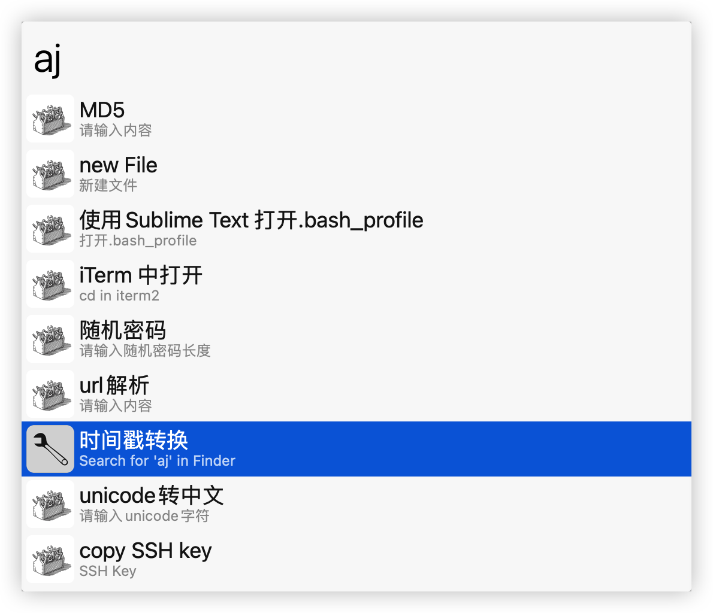
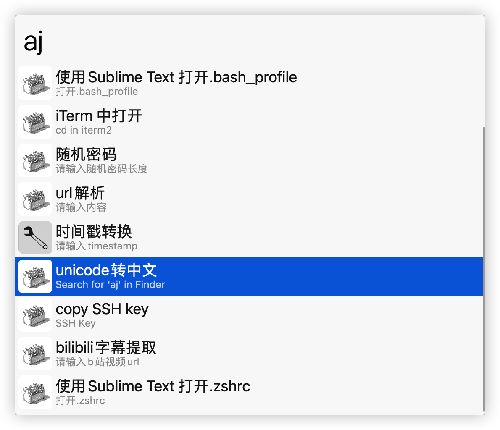

# MyToolBox
我常用的工具箱，不断完善和更新Alfred Workflow。

目前包含一下功能。

- 时间戳转换
- unicode转中文
- 随机密码
- MD5
- URL解析
- copy SHH Key
- Sublime3 打开.bash_profile
- Sublime3 打开.zshrc
- 打开当前窗口在iTerm2中
- 打开当前iTerm2路径在Finder中
- 当前文件夹下快速新建文件
- ChatGPT聊天

### 依赖环境

#### python3

依赖环境python3 没有python3的需要自行安装。

 pip3 install requests

 pip3 install bs4

#### Sublime3 打开.bash_profile

1.依赖Sublime3，需自行安装。

[【推荐梯子点击直达】](https://www.hjtnt.link/auth/register?code=QRY5)

